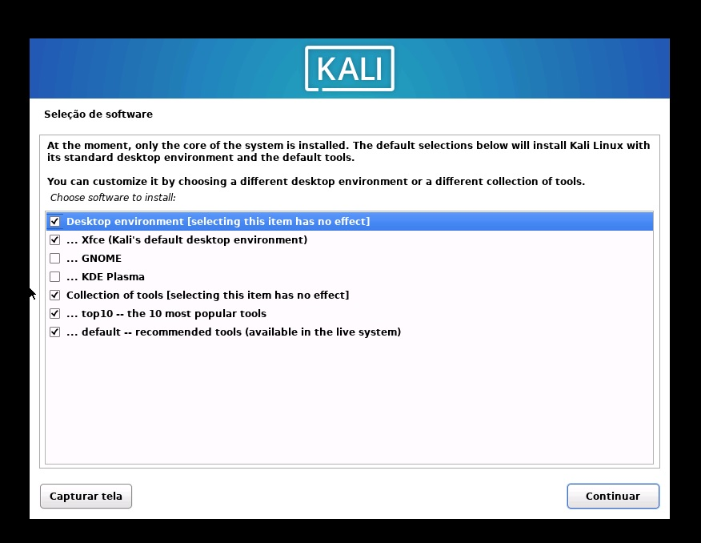

# **Passo-a-Passo de como instalar o Kali**

## _**Sobre**_
Kali Linux é uma distribuição baseada no Debian, desenvolvida e mantida pela _Offensive Security_, com foco em testes de penetração, análise forense digital e auditoria de segurança
Ele vem pré-instalado com centenas de ferramentas voltadas para diversas áreas da segurança da informação, como engenharia reversa, análise de vulnerabilidades, exploração, sniffing e spoofing de redes, entre outras

Destinado a profissionais de segurança, pentesters e pesquisadores, o Kali é amplamente reconhecido por sua flexibilidade e suporte a múltiplas plataformas, incluindo versões para ARM, containers Docker e ambientes em nuvem
Além disso, oferece recursos avançados como instalação persistente em live USBs e um modelo Rolling Release que garante atualizações frequentes

Kali Linux é gratuito e de código aberto, mantendo-se como uma das principais ferramentas no arsenal de profissionais de cibersegurança em todo o mundo

## _**Instalando**_
Siga o passo-a-passo após iniciar a VM
Após ligar a máquina virtual e selecionar o primeiro modo de instalação, você será levado para a primeira tela

> Selecionando a linguagem

> Selecionando o território

> Selecionando layout de teclado

> Configurando o relógio

> Configurando o nome da máquina

> Configurando o domínio

> Configurando o usuário

> Configurando o nome do usuário

> Configurando a senha

> Particionando o disco

  
  
  
  

> Escolhendo o ambiente

> Instalando o GRUB

> Atualizando o Kali

