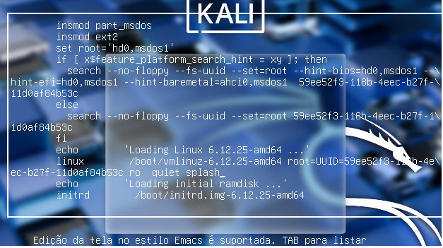
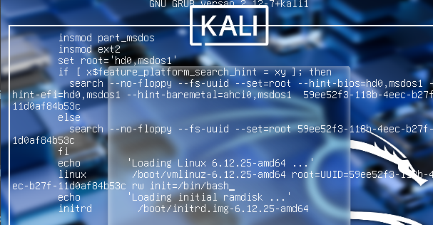
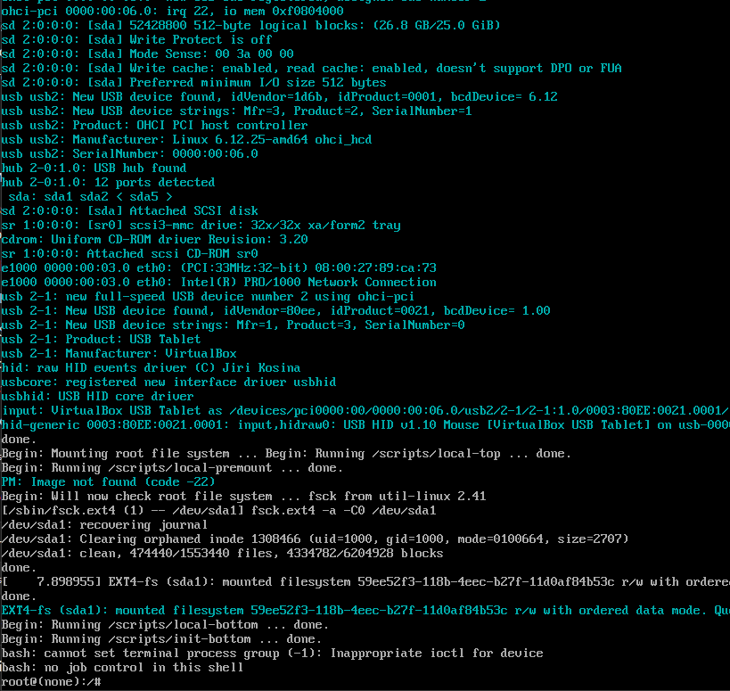

# _**Bypass em máquina física Linux**_
O procedimento descrito abaixo é uma técnica conhecida e legítima de **recuperação de senha em sistemas Linux** quando se tem acesso físico  
Geralmente utilizado quando você esquece a senha da máquina física ou virtual  
Com o <mark>carregador de boot GRUB</mark> é possível modificar temporariamente a forma como o sistema será iniciado  
Vamos aos comandos  
Para este exemplo, estaremos utilizando o Kali Linux, 

***

**ACESSANDO O GRUB**  
Quando aparecer a tela do GRUB, pressione a tecla ```e``` no menu de _boot_ padrão  
Isso permite a edição dos parâmetros de inicialização do Kernel Linux  
Encontre a linha que começa com _**linux /boot/vmlinuz... root=UUID=... ro quiet splash**_  



Vamos substiruir a parte <mark>ro quiet splash</mark> por <mark> rw init=/bin/bash</mark>  



Após, reinicializamos o sistema  
Vamos então ter um _root shell_ com **root@(none):/#**  

***

**REMONTANDO PARTIÇÃO COM ESCRITA**  
Primeiro, vamos digitar o comando abaixo
> ```bash
> mount -o remount, rw /
> ```


Segundo, vamos alterar a senha de usuário
> ```bash
> passwd [username]
> [new_password]
> [repeat_new_password]

Por fim, vamos voltar ao boot normal com o comando
> ```bash
> exec /sbin/init
> ```


Após, basta realizar login com a nova senha!

# _**Porque isso funciona?**_
Minha curiosidade era saber o porque disso funcionar  
Então fui buscar e descobri o seguinte  

Este trecho, <mark>linux /boot/vmlinuz-... root=UUID=... ro quiet splash</mark>, faz o seguinte:
* ```linux```: inicia o kernel com parâmetros
* ```/boot/vmlinuz-```: caminho para a imagem do kernel, arquivo do sistema que inicializa o Linux
* ```root=UUID=```: informa qual partição contém o sistema de arquivos raiz
* ```ro```: monta o sistema de arquivos raiz em modo _read-only_; mudado para _read-write_ durante _boot_
* ```quiet```: oculta mensagens do kernel na tela
* ```splash```: mostra uma tela gráfica durante o _boot_ em distros com o _splash screen_
* ```init=/bin/bash```: diz ao kernel para executar _bash_ como processo incial, ao invés de _/sbin/init_

O comando <mark>mount</mark> já conhecido, monsta sistemas de arquios Linux  
Com a _flag _ ```-o```, podemos passar arqugmentos extras  
A opção **remount** refere-se para _remontar_ um sistema de arquivos já montado, aplicar novas opções sem desmontar  
Por fim, ```rw``` diz ao sistema de arquivos que deve ser montado em modo leitura-escrita (_read-write_)  
Estamos fazendo isso onde? Na partição _root_, também conhecida por /  

O comando ```passwd``` é simples, serve para alterarmos a senha de um usuário

O diretório _/sbin/init_ é o primeiro processo executado pelo kernel depois que o Linux termina de carregar o sistema básico  
Também conhecido como **PID 1**  
Logo, o comando ```exec /sbin/init``` diz para executar a inicialização do sistema normalmente

# _**Questões de segurança e medidas de proteção**_

Quando se inicia o Linux com ```init=/bin/bash```, o sistema de arquivos _root_ normalmente é montado como _read-only_  por segurança  
Mas por realizar a alteração em <mark>linux /boot/vmlinuz... root=UUID=... ro quiet splash</mark>, podemos obter _root shell_ e controle total da máquina  podendo
* criar, destruir, exfiltrar dados
* implantar rootkits, keyloggers, abrir portas de redes
* inutilizar políticas de segurança comuns como sudoers, firewall, AppArmor e SELinux

Para proteger, podemos executar os seguintes comandos:
> ```bash
> grub-mkpasswd-pbkdf2
> ```
Altere o diretório para ```/etc/grub.d/40_custom``` e adicione
> ```bash
> set superuder="admin"
> ```
> ```bash
> [password_pbkdf2] admin [grub_hash]
> ```
> ```bash
> update-grub
> ```

O primeiro, solicita que você digite uma senha e em seguida, usa o algoritmo PBKDF2 para gerar um hash da senha  
O segundo cria um usuário ```admin``` e define a sua senha com o algoritmo definido  
Por fim, atualiza as novas alterações feitas no GRUB  

Mesmo que alguém consiga entrar com _root bash_ via GRUB, os dados estarão criptografados e inacessíveis  
Outra medida de proteção é configurar BIOS/UEFI com senha e desabilitar _boot_ por mídia externa  
